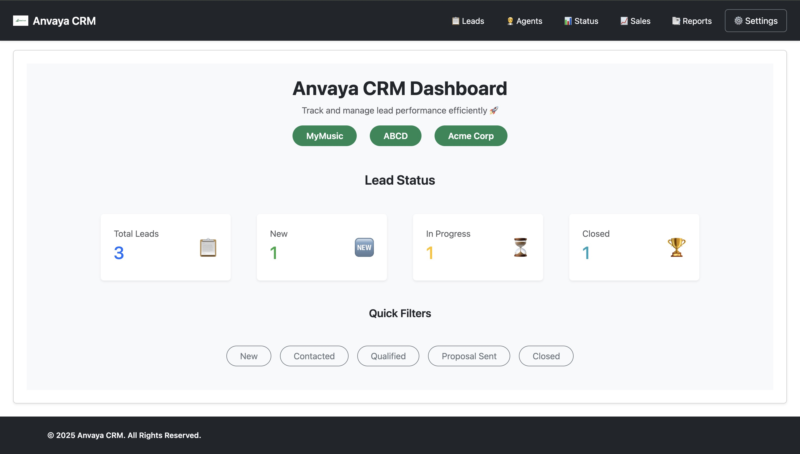
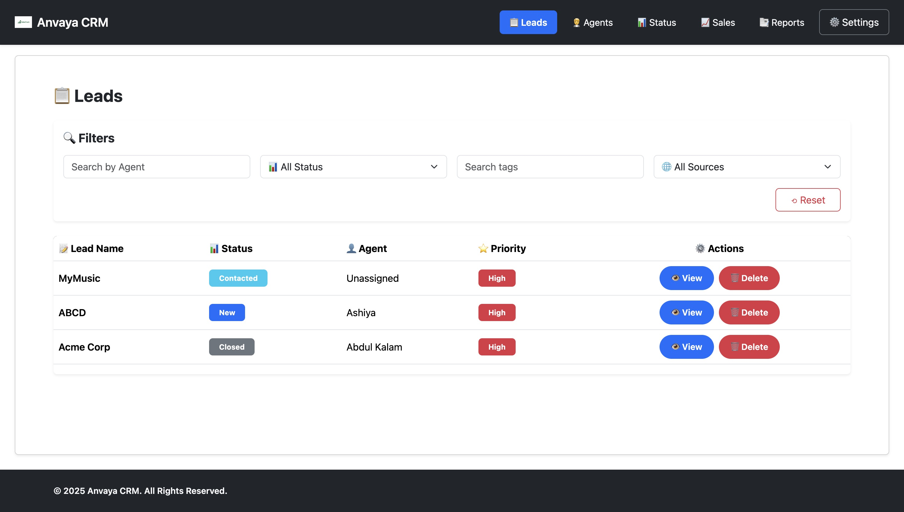
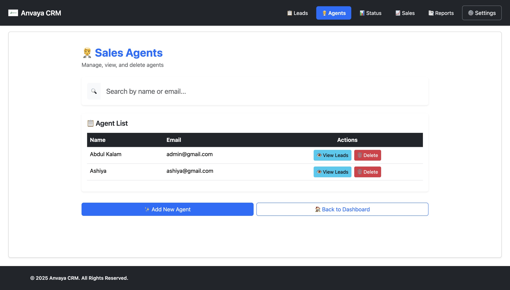
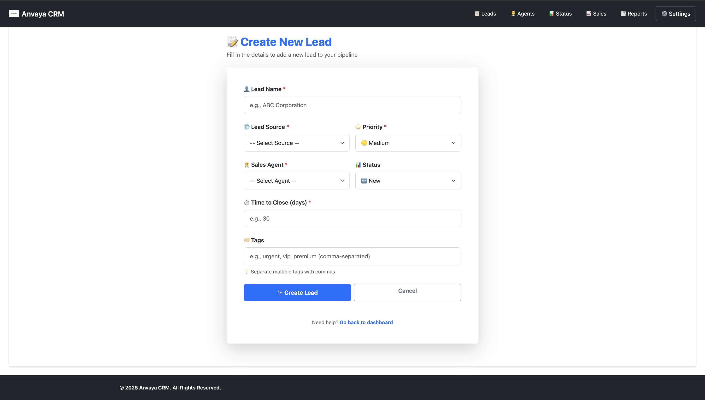
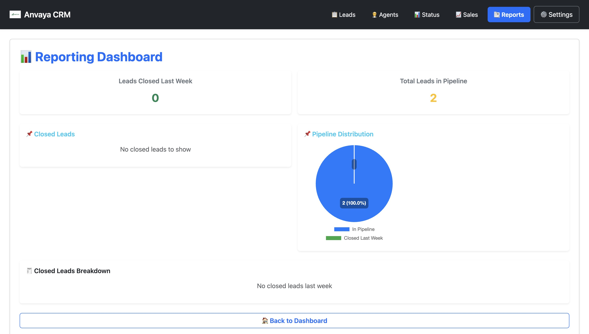

# 🚀 Anvaya CRM — Full Stack Project

A full-featured **Customer Relationship Management System** designed to help teams manage leads, track progress, assign sales agents, collaborate using comments, and generate real-time reports with visual insights.

---

## 🌍 Live Demo

| Layer    | URL                                        |
| -------- | ------------------------------------------ |
| Frontend | https://anvaya-crm-001.vercel.app/         |
| Backend  | https://anvaya-crm-backend-001.vercel.app/ |

---

## 🧩 Features

- Lead Create/Update/Delete
- Assign leads to sales agents
- Filter and Search leads by:
  - Status
  - Priority
  - Tags
  - Source
- Commenting and Activity Tracking
- Dashboard with charts (pipeline, progress, reporting)
- Fully responsive UI
- REST API powered integration

---

## 📸 UI Preview

> Upload screenshots inside `/screenshots/` folder and update paths below.

| Dashboard                              | Leads Table                    |
| -------------------------------------- | ------------------------------ |
|  |  |

| Sales Agents                     | Agents Form                                     |
| -------------------------------- | ----------------------------------------------- |
|  |  |

| Lead Form                                     | Reporting                            |
| --------------------------------------------- | ------------------------------------ |
|  |  |

---

## 🛠 Tech Stack

| Category   | Technology                                      |
| ---------- | ----------------------------------------------- |
| Frontend   | React, Axios, Bootstrap, React Router, Chart.js |
| Backend    | Node.js, Express, Mongoose                      |
| Database   | MongoDB (Atlas)                                 |
| Deployment | Vercel                                          |

---

## 📦 Setup Instructions

### 1️⃣ Clone Repository

```sh
git clone https://github.com/Abdul-Kalam0/Anvaya-CRM-Frontend.git
cd Anvaya-CRM-Frontend
```

### 2️⃣ Install Dependencies (Frontend + Backend)

```sh
cd client && npm install
cd ../server && npm install
```

### 3️⃣ Configure Environment Variables

Create a `.env` in `/server`:

```
PORT=3000
MONGO_URI=your_mongodb_connection_string
```

---

### 4️⃣ Run Project

#### Backend:

```sh
cd server
npm run dev
```

#### Frontend:

```sh
cd client
npm run dev
```

---

## 📡 Core API Routes

> Full API documentation located inside backend README.

| Method | Endpoint              | Purpose        |
| ------ | --------------------- | -------------- |
| POST   | `/leads`              | Create lead    |
| GET    | `/leads`              | Fetch leads    |
| PUT    | `/leads/:id`          | Edit lead      |
| DELETE | `/leads/:id`          | Delete lead    |
| POST   | `/agents`             | Create agent   |
| GET    | `/agents`             | Fetch agents   |
| POST   | `/leads/:id/comments` | Add comment    |
| GET    | `/report/...`         | Reporting data |

---

## 🚧 Upcoming Features

- JWT Authentication
- Bulk lead import/export (CSV)
- Multi-role permissions
- Notifications and reminders
- Dark mode

---

## 🤝 Contribution Guidelines

```sh
git checkout -b feature-name
git commit -m "feat: your change here"
git push origin feature-name
```

---

## 📜 License

MIT License © 2025 — Abdul Kalam

---

### ⭐ If you like this project, consider giving a **GitHub Star**!

Made with ❤️ by Abdul Kalam
